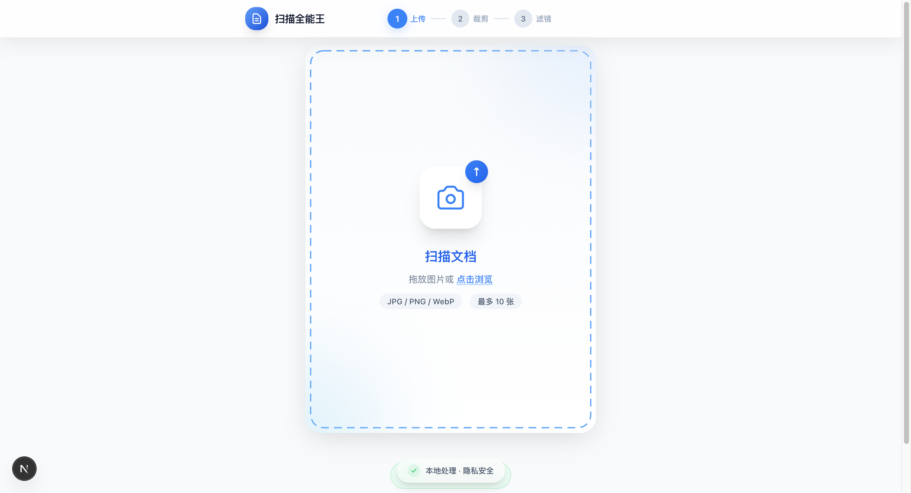

<div align="center">
  

# 扫描全能王 (Img2PDF)

**您的隐私文档扫描专家 - 本地处理，安全高效**

[](https://nextjs.org/)
[](https://react.dev/)
[](https://www.typescriptlang.org/)
[](https://github.com/zengwenliang416/img2pdf)
[](LICENSE)

</div>

<br/>

## 🖥️ 产品预览

<div align="center">
  
</div>

<br/>

## ✨ 核心亮点

**扫描全能王** 是一款基于浏览器的现代化文档扫描工具。不同于传统 App，我们坚持 **🔒 数据零上传**，所有图像处理均在您的本地浏览器中完成，确保您的隐私安全。

| ⚡️ 智能捕获                                                               | 🎨 专业滤镜                                                              | 📄 高清导出                                                               |
| :------------------------------------------------------------------------ | :----------------------------------------------------------------------- | :------------------------------------------------------------------------ |
| **毫秒级边缘检测**<br>基于 OpenCV.js 自动识别文档轮廓，智能去除背景杂乱。 | **5 种影像增强模式**<br>原图、灰度、黑白、增强、去阴影，还原文档清晰度。 | **多页 PDF 生成**<br>支持 A4/B5 等多种规格，一键生成高清 PDF 或打包 JPG。 |

## 🚀 功能特性

- **📸 灵活导入**：支持相机实时拍摄、本地文件上传，单次批量导入最多 10 张图片
- **✂️ 精准裁剪**：自动吸附边缘，四点手动微调，透视矫正更精准
- **🔄 页面管理**：拖拽排序、批量删除，每页可独立设置旋转方向和滤镜效果
- **🛡️ 隐私安全**：纯前端运行，无后端存储，您的文档只属于您自己
- **📱 全端兼容**：完美适配 PC、iOS 和 Android 浏览器

### 导出能力

| 导出格式 | 纸张尺寸                      | 质量设置      | 方向设置                  |
| -------- | ----------------------------- | ------------- | ------------------------- |
| PDF      | A4 / A5 / Letter / Legal / B5 | 50%-100% 可调 | 每页独立纵向/横向         |
| JPG      | -                             | 50%-100% 可调 | 支持旋转 0°/90°/180°/270° |
| ZIP      | -                             | 同 JPG        | 批量导出所有页            |

## 📖 使用指南

简单四步，完成专业扫描：

```
📸 上传/拍摄  →  ✂️ 智能裁剪  →  🎨 滤镜美化  →  📤 导出分享
```

1. **上传/拍摄** - 选择图片或直接拍照
2. **智能裁剪** - 系统自动框选，手动微调四角
3. **滤镜美化** - 选择"增强"或"黑白"滤镜清除底色
4. **导出分享** - 生成 PDF 文件或下载图片包

## 💻 快速开始

### 环境要求

- Node.js >= 20.9.0（Next.js 16 要求）
- pnpm >= 9

### 安装与运行

```bash
# 克隆项目
git clone https://github.com/zengwenliang416/img2pdf.git
cd img2pdf

# 安装依赖
pnpm install

# 启动开发环境
pnpm dev
```

访问 [http://localhost:3000](http://localhost:3000) 即可体验。

### 构建部署

```bash
# 构建生产版本
pnpm build

# 启动生产服务器
pnpm start
```

## 🛠️ 技术架构

> 版本以 `package.json` / `pnpm-lock.yaml` 为准

| 技术                                          | 版本      | 用途              |
| :-------------------------------------------- | :-------- | :---------------- |
| [Next.js](https://nextjs.org/)                | 16.0.10   | React 全栈框架    |
| [React](https://react.dev/)                   | 19.2.1    | UI 组件库         |
| [TypeScript](https://www.typescriptlang.org/) | 5.9.3     | 类型安全          |
| [Tailwind CSS](https://tailwindcss.com/)      | 4.1.18    | 样式框架          |
| [Zustand](https://zustand-demo.pmnd.rs/)      | 5.0.9     | 状态管理          |
| [OpenCV.js](https://docs.opencv.org/)         | 内置 WASM | 边缘检测/透视矫正 |
| [pdf-lib](https://pdf-lib.js.org/)            | 1.17.1    | PDF 生成          |
| [@dnd-kit](https://dndkit.com/)               | 6.3.1     | 拖拽排序          |
| [JSZip](https://stuk.github.io/jszip/)        | 3.10.1    | ZIP 打包          |

### 项目结构

```
img2pdf/
├── src/
│   ├── app/                    # Next.js App Router
│   ├── components/             # React 组件
│   │   ├── ui/                 # 基础 UI 组件
│   │   ├── ImageUpload.tsx     # 图片上传
│   │   ├── CornerEditor.tsx    # 四点编辑器
│   │   ├── FilterPanel.tsx     # 滤镜面板
│   │   └── ...
│   ├── hooks/                  # 业务 Hooks
│   ├── lib/
│   │   ├── opencv/             # OpenCV 图像处理
│   │   ├── utils/              # 工具函数
│   │   └── store.ts            # Zustand 状态管理
│   └── types/                  # TypeScript 类型定义
├── public/
│   └── opencv/                 # OpenCV.js 静态文件
└── docs/                       # 项目文档
```

### 核心模块

- **边缘检测** (`lib/opencv/detectEdges.ts`)：Canny + 轮廓查找 + 四边形拟合
- **透视变换** (`lib/opencv/perspectiveTransform.ts`)：四点透视矫正
- **滤镜处理** (`lib/opencv/imageFilters.ts`)：使用 Canvas 实现，避免 WASM 开销
- **PDF 导出** (`lib/utils/exportPdf.ts`)：pdf-lib 生成，支持质量控制

## 🔒 隐私与安全

- **本地处理**：边缘检测、裁剪、滤镜、PDF/ZIP 导出均在浏览器本地完成，不上传任何数据
- **相机权限**：拍照功能依赖 `getUserMedia`，仅在 HTTPS 或 localhost 环境可用
- **资源自托管**：OpenCV.js 从本地加载，无第三方 CDN 依赖

## 📱 浏览器兼容性

| 平台    | 浏览器  | 最低版本 |
| ------- | ------- | -------- |
| Desktop | Chrome  | 90+      |
| Desktop | Safari  | 14+      |
| Desktop | Firefox | 88+      |
| Desktop | Edge    | 90+      |
| iOS     | Safari  | 14+      |
| Android | Chrome  | 90+      |

## ⚡ 性能指标

| 指标             | 目标值  | 测试条件              |
| ---------------- | ------- | --------------------- |
| 边缘检测耗时     | < 2s    | 12MP 图片，中高端设备 |
| 滤镜切换响应     | < 100ms | -                     |
| PDF 生成（10页） | < 5s    | -                     |
| 首屏加载         | < 3s    | 4G 网络               |

## 🔧 开发指南

### 常用命令

```bash
pnpm dev          # 开发模式
pnpm build        # 构建生产版本
pnpm start        # 生产模式
pnpm lint         # ESLint 检查
pnpm exec tsc --noEmit  # TypeScript 类型检查
```

### 添加新滤镜

1. 在 `src/lib/opencv/imageFilters.ts` 中：
   - 扩展 `FilterType` 类型
   - 在 `applyFilter` 的 `switch` 中实现处理逻辑
   - 更新 `getFilterName` / `AVAILABLE_FILTERS`
2. `FilterPanel` 默认使用 `AVAILABLE_FILTERS` 渲染按钮

### 自定义纸张尺寸

在 `src/lib/store.ts` 中修改 `PAPER_SIZES` 常量：

```typescript
export const PAPER_SIZES: Record<
  PaperSize,
  { width: number; height: number; label: string }
> = {
  a4: { width: 595.28, height: 841.89, label: "A4" },
  // 添加新尺寸...
};
```

## 🧯 故障排查

- **OpenCV 加载失败**：确认 `public/opencv/opencv.js` 存在，检查浏览器控制台网络请求
- **相机不可用**：确认使用 HTTPS 或 localhost，检查浏览器权限设置
- **导出很慢**：尝试降低导出质量（50%～80%）或减少页数

## 📚 文档

更详细的设计与算法说明见 `docs/`：

- `docs/04-technical-architecture.md`：技术架构与模块划分
- `docs/05-image-algorithms.md`：边缘检测/透视矫正算法说明
- `docs/06-security-compliance.md`：隐私与安全合规

## 🤝 参与贡献

欢迎提交 Issue 和 Pull Request！

1. Fork 本仓库
2. 创建分支 (`git checkout -b feature/AmazingFeature`)
3. 提交更改 (`git commit -m 'feat: Add AmazingFeature'`)
4. 推送分支 (`git push origin feature/AmazingFeature`)
5. 提交 Pull Request

## 📄 许可证

本项目基于 [MIT License](LICENSE) 开源。

---

<div align="center">
  <sub>Made with ❤️ by <a href="https://github.com/zengwenliang416">zengwenliang416</a></sub>
</div>
