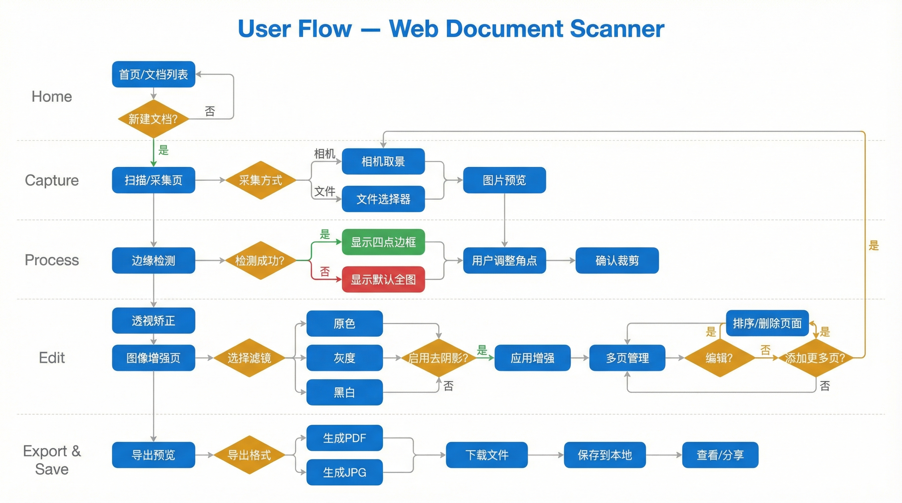
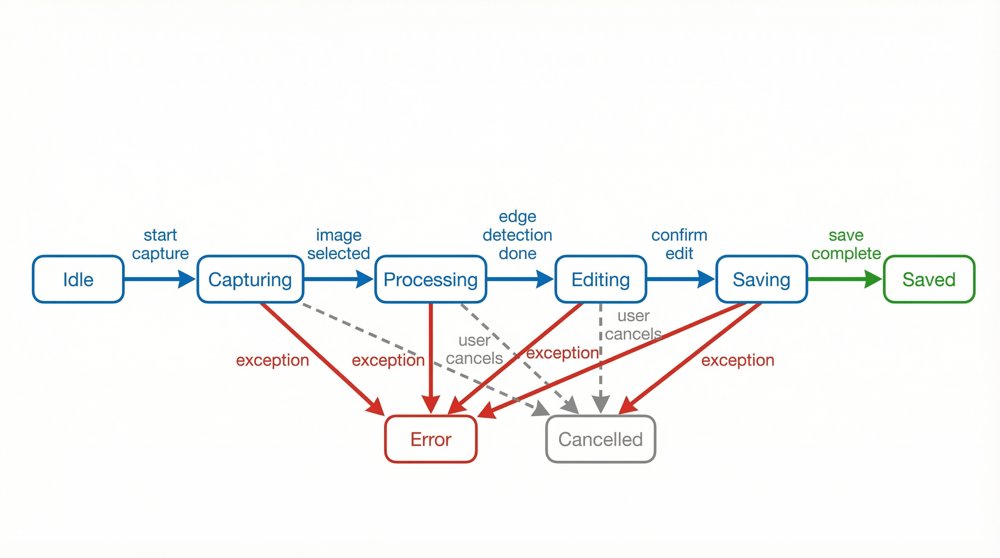
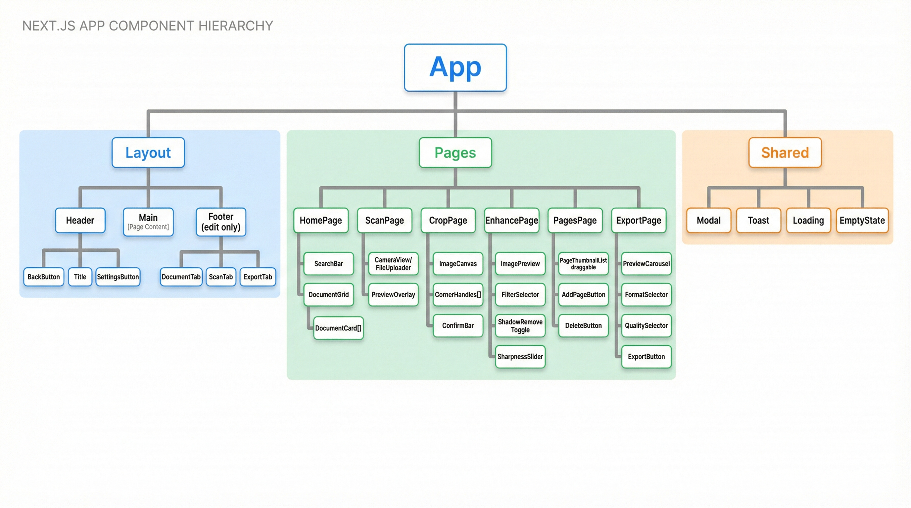

# 3. 信息架构与用户流程

## 页面列表

| 页面          | 路由                 | 功能描述                         |
| ------------- | -------------------- | -------------------------------- |
| 首页/文档列表 | `/`                  | 展示所有文档，搜索入口，新建入口 |
| 扫描/采集     | `/scan`              | 相机拍照或文件上传               |
| 边缘编辑      | `/edit/[id]/crop`    | 四点边缘调整                     |
| 图像增强      | `/edit/[id]/enhance` | 滤镜、去阴影、清晰度             |
| 多页管理      | `/edit/[id]/pages`   | 页面排序、删除、添加             |
| 导出预览      | `/edit/[id]/export`  | 预览并导出 PDF/JPG               |
| 文档详情      | `/doc/[id]`          | 查看完整文档、编辑标题           |
| 设置          | `/settings`          | 偏好设置、存储管理               |

## 用户流程图



## 移动端导航结构


## 页面状态流转

### 扫描流程状态机



### 状态定义

| 状态         | 描述                     | UI展示              |
| ------------ | ------------------------ | ------------------- |
| `idle`       | 等待用户操作             | 显示扫描/上传按钮   |
| `capturing`  | 正在拍照/选择文件        | 相机界面/文件选择器 |
| `processing` | 正在处理图片（边缘检测） | 加载动画+进度提示   |
| `editing`    | 用户编辑中               | 编辑工具栏          |
| `saving`     | 正在保存                 | 保存中提示          |
| `saved`      | 保存成功                 | 成功提示，跳转列表  |
| `error`      | 发生错误                 | 错误提示，重试按钮  |
| `cancelled`  | 用户取消                 | 返回上一状态        |

## 组件层次结构



## 路由配置

```typescript
// app/layout.tsx - App Router 结构

app/
├── layout.tsx              // 根布局
├── page.tsx                // 首页 /
├── scan/
│   └── page.tsx            // 扫描页 /scan
├── edit/
│   └── [id]/
│       ├── layout.tsx      // 编辑布局
│       ├── crop/
│       │   └── page.tsx    // 裁剪页 /edit/[id]/crop
│       ├── enhance/
│       │   └── page.tsx    // 增强页 /edit/[id]/enhance
│       ├── pages/
│       │   └── page.tsx    // 多页管理 /edit/[id]/pages
│       └── export/
│           └── page.tsx    // 导出页 /edit/[id]/export
├── doc/
│   └── [id]/
│       └── page.tsx        // 文档详情 /doc/[id]
└── settings/
    └── page.tsx            // 设置页 /settings
```
