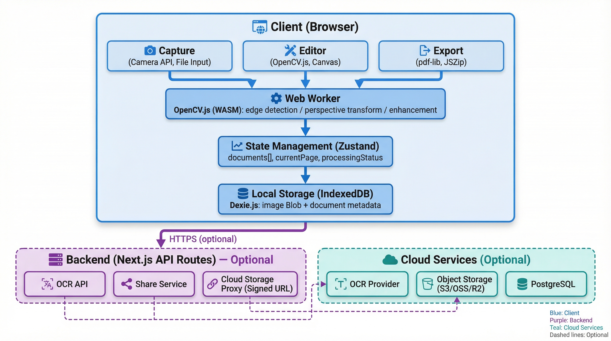

# 4. 技术架构（前后端）

## 整体架构图



## 前端模块划分

| 模块                  | 职责                 | 核心技术                   | 替代方案               |
| --------------------- | -------------------- | -------------------------- | ---------------------- |
| **采集(Capture)**     | 相机访问、文件上传   | MediaDevices API, File API | react-webcam           |
| **检测(Detection)**   | 边缘检测、角点识别   | OpenCV.js (WASM)           | TensorFlow.js, marvinj |
| **编辑(Editor)**      | 四点调整、裁剪、旋转 | Canvas API, Konva.js       | Fabric.js              |
| **增强(Enhancement)** | 滤镜、去阴影、锐化   | OpenCV.js, CSS filters     | CamanJS                |
| **文档(Document)**    | 多页管理、排序       | React DnD, Zustand         | SortableJS             |
| **导出(Export)**      | PDF/JPG生成          | pdf-lib, JSZip             | jsPDF, pdfmake         |
| **存储(Storage)**     | 本地持久化           | Dexie.js (IndexedDB)       | localForage            |
| **状态(State)**       | 全局状态管理         | Zustand                    | Jotai, Redux Toolkit   |

## 后端必要性分析

| 场景         | 纯前端可行性 | 后端必要性 | 原因                   |
| ------------ | ------------ | ---------- | ---------------------- |
| 边缘检测     | ✅ 可行      | ❌ 不必须  | OpenCV.js 足够         |
| PDF导出      | ✅ 可行      | ❌ 不必须  | pdf-lib 前端完成       |
| 本地存储     | ✅ 可行      | ❌ 不必须  | IndexedDB              |
| **OCR识别**  | ⚠️ 有限      | ✅ 必须    | 云服务API密钥需保护    |
| **分享链接** | ❌ 不可行    | ✅ 必须    | 需要持久化URL+权限验证 |
| **云端同步** | ❌ 不可行    | ✅ 必须    | 对象存储签名URL        |
| **大图处理** | ⚠️ 性能差    | ⭕ 可选    | 低端设备降级方案       |

**结论：MVP阶段后端主要用于OCR和分享功能，核心扫描流程纯前端完成。**

## 后端 API 设计

### API 列表

| 端点              | 方法 | 功能                 | 优先级 |
| ----------------- | ---- | -------------------- | ------ |
| `/api/ocr`        | POST | OCR文字识别          | P1     |
| `/api/share`      | POST | 创建分享链接         | P2     |
| `/api/share/[id]` | GET  | 获取分享内容         | P2     |
| `/api/upload`     | POST | 上传到云存储         | P2     |
| `/api/process`    | POST | 服务端图像处理(降级) | P3     |

### API 详细设计

#### 1. OCR识别 `/api/ocr`

```typescript
// 请求
POST /api/ocr
Content-Type: multipart/form-data

{
  image: File,              // 图片文件
  language: "zh-CN" | "en"  // 识别语言
}

// 响应 200
{
  success: true,
  data: {
    text: "识别的全部文字...",
    blocks: [
      {
        text: "第一段文字",
        confidence: 0.98,
        boundingBox: { x: 10, y: 20, width: 100, height: 30 }
      }
    ]
  }
}

// 响应 400
{
  success: false,
  error: "INVALID_IMAGE",
  message: "图片格式不支持"
}
```

#### 2. 创建分享 `/api/share`

```typescript
// 请求
POST /api/share
Content-Type: application/json

{
  documentId: "doc_xxx",
  expireIn: 86400,          // 秒，默认24小时
  password?: "abc123",      // 可选密码
  allowDownload: true
}

// 响应 200
{
  success: true,
  data: {
    shareId: "share_yyy",
    shareUrl: "https://app.com/s/share_yyy",
    expiresAt: "2024-01-02T00:00:00Z"
  }
}
```

#### 3. 获取分享 `/api/share/[id]`

```typescript
// 请求
GET /api/share/share_yyy?password=abc123

// 响应 200
{
  success: true,
  data: {
    title: "文档标题",
    pages: [
      { url: "https://cdn.../page1.jpg", order: 1 }
    ],
    allowDownload: true,
    pdfUrl?: "https://cdn.../doc.pdf"
  }
}

// 响应 401 (密码错误)
{
  success: false,
  error: "INVALID_PASSWORD"
}

// 响应 410 (已过期)
{
  success: false,
  error: "SHARE_EXPIRED"
}
```

## 数据模型

### 本地存储 (IndexedDB via Dexie.js)

```typescript
// db.ts
import Dexie, { Table } from "dexie";

interface Page {
  id: string; // nanoid 生成
  documentId: string; // 所属文档ID
  originalBlob: Blob; // 原始图片
  processedBlob?: Blob; // 处理后图片
  thumbnailBlob?: Blob; // 缩略图 (200x200)
  corners: [Point, Point, Point, Point] | null; // 四角坐标
  filter: "original" | "grayscale" | "bw" | "enhanced";
  rotation: 0 | 90 | 180 | 270;
  order: number;
  createdAt: Date;
  updatedAt: Date;
}

interface Document {
  id: string;
  title: string;
  pageIds: string[]; // 页面ID数组
  coverThumbnail?: Blob; // 封面缩略图
  pageCount: number;
  isUploaded: boolean; // 是否已同步云端
  cloudId?: string; // 云端ID
  createdAt: Date;
  updatedAt: Date;
}

interface Point {
  x: number;
  y: number;
}

class ScannerDB extends Dexie {
  documents!: Table<Document>;
  pages!: Table<Page>;

  constructor() {
    super("ScannerDB");
    this.version(1).stores({
      documents: "id, title, updatedAt, createdAt",
      pages: "id, documentId, order",
    });
  }
}

export const db = new ScannerDB();
```

### 云端存储 (可选 - PostgreSQL)

```sql
-- 用户表 (如需用户系统)
CREATE TABLE users (
  id UUID PRIMARY KEY DEFAULT gen_random_uuid(),
  email VARCHAR(255) UNIQUE,
  created_at TIMESTAMP DEFAULT NOW()
);

-- 文档元数据表
CREATE TABLE documents (
  id UUID PRIMARY KEY DEFAULT gen_random_uuid(),
  user_id UUID REFERENCES users(id),
  title VARCHAR(255) NOT NULL,
  page_count INT DEFAULT 0,
  storage_path VARCHAR(500),  -- OSS路径前缀
  created_at TIMESTAMP DEFAULT NOW(),
  updated_at TIMESTAMP DEFAULT NOW()
);

-- 分享链接表
CREATE TABLE shares (
  id VARCHAR(12) PRIMARY KEY,  -- 短ID
  document_id UUID REFERENCES documents(id),
  password_hash VARCHAR(255),
  expires_at TIMESTAMP,
  allow_download BOOLEAN DEFAULT true,
  view_count INT DEFAULT 0,
  created_at TIMESTAMP DEFAULT NOW()
);

-- 索引
CREATE INDEX idx_documents_user ON documents(user_id);
CREATE INDEX idx_shares_expires ON shares(expires_at);
```

### 对象存储结构 (OSS/S3/R2)

```
bucket/
├── users/
│   └── {userId}/
│       └── documents/
│           └── {documentId}/
│               ├── original/
│               │   ├── page_001.jpg
│               │   └── page_002.jpg
│               ├── processed/
│               │   ├── page_001.jpg
│               │   └── page_002.jpg
│               └── exports/
│                   └── document.pdf
```

## 技术选型对比

### 状态管理

| 方案           | 优点                            | 缺点       | 适用场景   |
| -------------- | ------------------------------- | ---------- | ---------- |
| **Zustand** ✅ | 轻量(~1KB)、API简洁、无样板代码 | 生态较小   | 中小型应用 |
| Jotai          | 原子化、按需更新                | 学习曲线   | 细粒度状态 |
| Redux Toolkit  | 生态成熟、DevTools              | 样板代码多 | 大型应用   |

### 图像处理

| 方案             | 优点               | 缺点       | 适用场景   |
| ---------------- | ------------------ | ---------- | ---------- |
| **OpenCV.js** ✅ | 功能全面、WASM加速 | 包大(~8MB) | 复杂CV任务 |
| TensorFlow.js    | 深度学习能力       | 需要模型   | 智能识别   |
| Canvas原生       | 无依赖             | 功能有限   | 简单操作   |

### PDF生成

| 方案            | 优点           | 缺点       | 适用场景  |
| --------------- | -------------- | ---------- | --------- |
| **pdf-lib** ✅  | 专业、支持修改 | API略复杂  | 高质量PDF |
| jsPDF           | 简单易用       | 功能有限   | 简单PDF   |
| Puppeteer(后端) | 完美渲染       | 需要服务器 | 复杂排版  |
