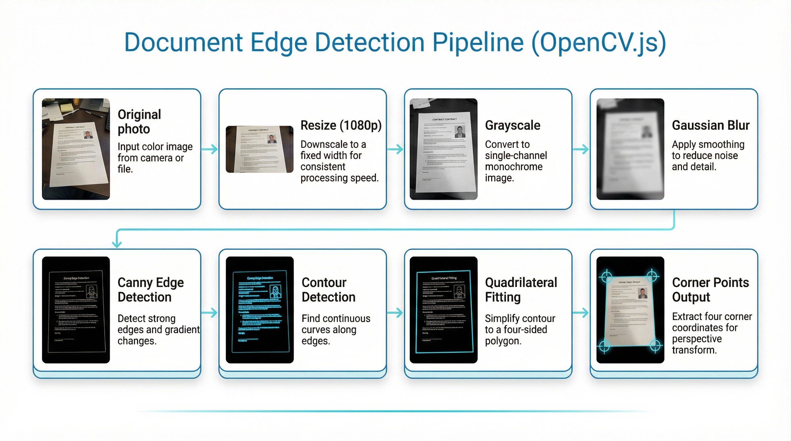

# 5. 图像算法落地方案

## OpenCV.js 加载与初始化

```typescript
// lib/opencv-loader.ts
let cvReady = false;
let cvPromise: Promise<void> | null = null;

export function loadOpenCV(): Promise<void> {
  if (cvReady) return Promise.resolve();
  if (cvPromise) return cvPromise;

  cvPromise = new Promise((resolve, reject) => {
    const script = document.createElement("script");
    script.src = "/opencv.js"; // 放在 public 目录
    script.async = true;
    script.onload = () => {
      // @ts-ignore
      cv["onRuntimeInitialized"] = () => {
        cvReady = true;
        resolve();
      };
    };
    script.onerror = reject;
    document.head.appendChild(script);
  });

  return cvPromise;
}
```

## 边缘检测算法

### 核心流程



### 实现代码

```typescript
// lib/edge-detection.ts
interface Point {
  x: number;
  y: number;
}

interface DetectionResult {
  corners: [Point, Point, Point, Point] | null;
  confidence: number;
  debugImage?: ImageData; // 调试用
}

export async function detectDocumentEdges(
  imageData: ImageData,
  options = { debug: false },
): Promise<DetectionResult> {
  const src = cv.matFromImageData(imageData);
  const gray = new cv.Mat();
  const blurred = new cv.Mat();
  const edges = new cv.Mat();
  const contours = new cv.MatVector();
  const hierarchy = new cv.Mat();

  try {
    // 1. 转灰度
    cv.cvtColor(src, gray, cv.COLOR_RGBA2GRAY);

    // 2. 高斯模糊降噪
    cv.GaussianBlur(gray, blurred, new cv.Size(5, 5), 0);

    // 3. Canny边缘检测
    cv.Canny(blurred, edges, 75, 200);

    // 4. 查找轮廓
    cv.findContours(
      edges,
      contours,
      hierarchy,
      cv.RETR_LIST,
      cv.CHAIN_APPROX_SIMPLE,
    );

    // 5. 按面积排序，找最大轮廓
    const sortedContours = [];
    for (let i = 0; i < contours.size(); i++) {
      const contour = contours.get(i);
      const area = cv.contourArea(contour);
      sortedContours.push({ contour, area, index: i });
    }
    sortedContours.sort((a, b) => b.area - a.area);

    // 6. 寻找四边形
    for (const { contour, area } of sortedContours.slice(0, 5)) {
      const peri = cv.arcLength(contour, true);
      const approx = new cv.Mat();
      cv.approxPolyDP(contour, approx, 0.02 * peri, true);

      if (approx.rows === 4) {
        const corners = extractCorners(approx, src.cols, src.rows);
        const confidence = area / (src.cols * src.rows);

        approx.delete();
        return {
          corners: orderCorners(corners),
          confidence: Math.min(confidence * 2, 1),
        };
      }
      approx.delete();
    }

    // 未找到四边形，返回null
    return { corners: null, confidence: 0 };
  } finally {
    // 释放内存
    src.delete();
    gray.delete();
    blurred.delete();
    edges.delete();
    contours.delete();
    hierarchy.delete();
  }
}

// 提取角点坐标
function extractCorners(
  approx: cv.Mat,
  width: number,
  height: number,
): Point[] {
  const corners: Point[] = [];
  for (let i = 0; i < 4; i++) {
    corners.push({
      x: approx.data32S[i * 2] / width,
      y: approx.data32S[i * 2 + 1] / height,
    });
  }
  return corners;
}

// 排序角点：左上、右上、右下、左下
function orderCorners(corners: Point[]): [Point, Point, Point, Point] {
  const sorted = [...corners];
  // 按y坐标分上下两组
  sorted.sort((a, b) => a.y - b.y);
  const top = sorted.slice(0, 2).sort((a, b) => a.x - b.x);
  const bottom = sorted.slice(2, 4).sort((a, b) => a.x - b.x);
  return [top[0], top[1], bottom[1], bottom[0]];
}
```

## 透视变换

```typescript
// lib/perspective-transform.ts
export async function perspectiveTransform(
  imageData: ImageData,
  corners: [Point, Point, Point, Point],
  outputSize?: { width: number; height: number },
): Promise<ImageData> {
  const src = cv.matFromImageData(imageData);
  const { width, height } = imageData;

  // 计算输出尺寸（保持文档原始比例或指定比例）
  const outputWidth = outputSize?.width || calculateOutputWidth(corners, width);
  const outputHeight =
    outputSize?.height || calculateOutputHeight(corners, height);

  // 源点（原图中的四个角）
  const srcPoints = cv.matFromArray(4, 1, cv.CV_32FC2, [
    corners[0].x * width,
    corners[0].y * height,
    corners[1].x * width,
    corners[1].y * height,
    corners[2].x * width,
    corners[2].y * height,
    corners[3].x * width,
    corners[3].y * height,
  ]);

  // 目标点（矩形）
  const dstPoints = cv.matFromArray(4, 1, cv.CV_32FC2, [
    0,
    0,
    outputWidth,
    0,
    outputWidth,
    outputHeight,
    0,
    outputHeight,
  ]);

  // 计算变换矩阵
  const M = cv.getPerspectiveTransform(srcPoints, dstPoints);

  // 执行变换
  const dst = new cv.Mat();
  cv.warpPerspective(
    src,
    dst,
    M,
    new cv.Size(outputWidth, outputHeight),
    cv.INTER_LINEAR,
    cv.BORDER_CONSTANT,
    new cv.Scalar(255, 255, 255, 255),
  );

  // 转换回ImageData
  const result = new ImageData(
    new Uint8ClampedArray(dst.data),
    outputWidth,
    outputHeight,
  );

  // 清理
  src.delete();
  srcPoints.delete();
  dstPoints.delete();
  M.delete();
  dst.delete();

  return result;
}

function calculateOutputWidth(corners: Point[], originalWidth: number): number {
  const topWidth = Math.sqrt(
    Math.pow((corners[1].x - corners[0].x) * originalWidth, 2) +
      Math.pow((corners[1].y - corners[0].y) * originalWidth, 2),
  );
  const bottomWidth = Math.sqrt(
    Math.pow((corners[2].x - corners[3].x) * originalWidth, 2) +
      Math.pow((corners[2].y - corners[3].y) * originalWidth, 2),
  );
  return Math.max(topWidth, bottomWidth);
}

function calculateOutputHeight(
  corners: Point[],
  originalHeight: number,
): number {
  const leftHeight = Math.sqrt(
    Math.pow((corners[3].x - corners[0].x) * originalHeight, 2) +
      Math.pow((corners[3].y - corners[0].y) * originalHeight, 2),
  );
  const rightHeight = Math.sqrt(
    Math.pow((corners[2].x - corners[1].x) * originalHeight, 2) +
      Math.pow((corners[2].y - corners[1].y) * originalHeight, 2),
  );
  return Math.max(leftHeight, rightHeight);
}
```

## 图像增强滤镜

### 滤镜类型定义

```typescript
// types/filters.ts
export type FilterType = "original" | "grayscale" | "bw" | "enhanced";

export interface FilterOptions {
  brightness?: number; // -100 to 100
  contrast?: number; // -100 to 100
  sharpness?: number; // 0 to 100
  shadowRemoval?: boolean;
}
```

### CSS滤镜预览（快速响应）

```typescript
// lib/css-filters.ts
export function getCSSFilter(
  type: FilterType,
  options: FilterOptions = {},
): string {
  const { brightness = 0, contrast = 0 } = options;
  const brightnessValue = 1 + brightness / 100;
  const contrastValue = 1 + contrast / 100;

  switch (type) {
    case "grayscale":
      return `grayscale(1) brightness(${brightnessValue}) contrast(${contrastValue})`;
    case "bw":
      return `grayscale(1) contrast(2) brightness(${brightnessValue})`;
    case "enhanced":
      return `contrast(1.2) saturate(1.1) brightness(${brightnessValue})`;
    default:
      return `brightness(${brightnessValue}) contrast(${contrastValue})`;
  }
}
```

### OpenCV.js 滤镜处理（导出用）

```typescript
// lib/image-filters.ts
export async function applyFilter(
  imageData: ImageData,
  type: FilterType,
  options: FilterOptions = {},
): Promise<ImageData> {
  const src = cv.matFromImageData(imageData);
  const dst = new cv.Mat();

  try {
    switch (type) {
      case "grayscale":
        cv.cvtColor(src, dst, cv.COLOR_RGBA2GRAY);
        cv.cvtColor(dst, dst, cv.COLOR_GRAY2RGBA);
        break;

      case "bw":
        cv.cvtColor(src, dst, cv.COLOR_RGBA2GRAY);
        cv.threshold(dst, dst, 0, 255, cv.THRESH_BINARY + cv.THRESH_OTSU);
        cv.cvtColor(dst, dst, cv.COLOR_GRAY2RGBA);
        break;

      case "enhanced":
        applyEnhancement(src, dst, options);
        break;

      default:
        src.copyTo(dst);
    }

    // 应用锐化
    if (options.sharpness && options.sharpness > 0) {
      applySharpen(dst, dst, options.sharpness);
    }

    // 去阴影
    if (options.shadowRemoval) {
      removeShadow(dst, dst);
    }

    return new ImageData(new Uint8ClampedArray(dst.data), dst.cols, dst.rows);
  } finally {
    src.delete();
    dst.delete();
  }
}

// 增强处理
function applyEnhancement(src: cv.Mat, dst: cv.Mat, options: FilterOptions) {
  // CLAHE 对比度增强
  const gray = new cv.Mat();
  cv.cvtColor(src, gray, cv.COLOR_RGBA2GRAY);

  const clahe = new cv.CLAHE(2.0, new cv.Size(8, 8));
  clahe.apply(gray, gray);

  // 转回彩色
  cv.cvtColor(gray, dst, cv.COLOR_GRAY2RGBA);

  gray.delete();
}

// 锐化处理
function applySharpen(src: cv.Mat, dst: cv.Mat, amount: number) {
  const kernel = cv.matFromArray(3, 3, cv.CV_32FC1, [
    0,
    -1 * (amount / 100),
    0,
    -1 * (amount / 100),
    1 + 4 * (amount / 100),
    -1 * (amount / 100),
    0,
    -1 * (amount / 100),
    0,
  ]);

  cv.filter2D(src, dst, -1, kernel);
  kernel.delete();
}

// 去阴影（自适应阈值）
function removeShadow(src: cv.Mat, dst: cv.Mat) {
  const gray = new cv.Mat();
  const blur = new cv.Mat();
  const divide = new cv.Mat();

  // 转灰度
  cv.cvtColor(src, gray, cv.COLOR_RGBA2GRAY);

  // 大核高斯模糊获取背景
  cv.GaussianBlur(gray, blur, new cv.Size(21, 21), 0);

  // 原图除以背景，消除阴影
  cv.divide(gray, blur, divide, 255);

  // 转回RGBA
  cv.cvtColor(divide, dst, cv.COLOR_GRAY2RGBA);

  gray.delete();
  blur.delete();
  divide.delete();
}
```

## PDF 导出

```typescript
// lib/pdf-export.ts
import { PDFDocument } from "pdf-lib";

export interface ExportOptions {
  quality?: number; // 0-1, JPEG质量
  pageSize?: "A4" | "Letter" | "Original";
  margin?: number; // 页边距(pt)
}

export async function exportToPDF(
  pages: Blob[],
  options: ExportOptions = {},
): Promise<Blob> {
  const { quality = 0.85, pageSize = "A4", margin = 0 } = options;

  const pdfDoc = await PDFDocument.create();

  // 页面尺寸映射 (pt)
  const pageSizes = {
    A4: { width: 595.28, height: 841.89 },
    Letter: { width: 612, height: 792 },
    Original: null, // 使用图片原始比例
  };

  for (const pageBlob of pages) {
    // 压缩图片
    const compressedBlob = await compressImage(pageBlob, quality);
    const imageBytes = await compressedBlob.arrayBuffer();

    // 嵌入图片
    const image = await pdfDoc.embedJpg(new Uint8Array(imageBytes));

    // 计算页面尺寸
    let pageWidth: number;
    let pageHeight: number;

    if (pageSize === "Original" || !pageSizes[pageSize]) {
      // 使用图片原始比例
      const maxWidth = 595.28; // A4宽度作为最大值
      const scale = maxWidth / image.width;
      pageWidth = image.width * scale;
      pageHeight = image.height * scale;
    } else {
      pageWidth = pageSizes[pageSize].width;
      pageHeight = pageSizes[pageSize].height;
    }

    // 创建页面
    const page = pdfDoc.addPage([pageWidth, pageHeight]);

    // 计算图片绘制区域（居中，保持比例）
    const drawWidth = pageWidth - margin * 2;
    const drawHeight = pageHeight - margin * 2;
    const imageAspect = image.width / image.height;
    const pageAspect = drawWidth / drawHeight;

    let finalWidth: number;
    let finalHeight: number;

    if (imageAspect > pageAspect) {
      finalWidth = drawWidth;
      finalHeight = drawWidth / imageAspect;
    } else {
      finalHeight = drawHeight;
      finalWidth = drawHeight * imageAspect;
    }

    const x = margin + (drawWidth - finalWidth) / 2;
    const y = margin + (drawHeight - finalHeight) / 2;

    // 绘制图片
    page.drawImage(image, {
      x,
      y,
      width: finalWidth,
      height: finalHeight,
    });
  }

  // 生成PDF
  const pdfBytes = await pdfDoc.save();
  return new Blob([pdfBytes], { type: "application/pdf" });
}

// 图片压缩
async function compressImage(blob: Blob, quality: number): Promise<Blob> {
  return new Promise((resolve) => {
    const img = new Image();
    img.onload = () => {
      const canvas = document.createElement("canvas");
      canvas.width = img.width;
      canvas.height = img.height;

      const ctx = canvas.getContext("2d")!;
      ctx.drawImage(img, 0, 0);

      canvas.toBlob(
        (compressedBlob) => {
          resolve(compressedBlob || blob);
        },
        "image/jpeg",
        quality,
      );
    };
    img.src = URL.createObjectURL(blob);
  });
}
```

## Web Worker 封装

```typescript
// workers/opencv.worker.ts
import { detectDocumentEdges } from "../lib/edge-detection";
import { perspectiveTransform } from "../lib/perspective-transform";
import { applyFilter } from "../lib/image-filters";

self.onmessage = async (e: MessageEvent) => {
  const { type, payload, id } = e.data;

  try {
    let result;

    switch (type) {
      case "DETECT_EDGES":
        result = await detectDocumentEdges(payload.imageData, payload.options);
        break;

      case "PERSPECTIVE_TRANSFORM":
        result = await perspectiveTransform(
          payload.imageData,
          payload.corners,
          payload.outputSize,
        );
        break;

      case "APPLY_FILTER":
        result = await applyFilter(
          payload.imageData,
          payload.filterType,
          payload.options,
        );
        break;

      default:
        throw new Error(`Unknown message type: ${type}`);
    }

    self.postMessage({ id, success: true, result });
  } catch (error) {
    self.postMessage({
      id,
      success: false,
      error: error instanceof Error ? error.message : "Unknown error",
    });
  }
};

// hooks/useOpenCVWorker.ts
import { useRef, useCallback, useEffect } from "react";

export function useOpenCVWorker() {
  const workerRef = useRef<Worker | null>(null);
  const callbacksRef = useRef<Map<string, (result: any) => void>>(new Map());

  useEffect(() => {
    workerRef.current = new Worker(
      new URL("../workers/opencv.worker.ts", import.meta.url),
    );

    workerRef.current.onmessage = (e) => {
      const { id, success, result, error } = e.data;
      const callback = callbacksRef.current.get(id);
      if (callback) {
        callback(success ? result : Promise.reject(new Error(error)));
        callbacksRef.current.delete(id);
      }
    };

    return () => {
      workerRef.current?.terminate();
    };
  }, []);

  const postMessage = useCallback(
    <T>(type: string, payload: any): Promise<T> => {
      return new Promise((resolve, reject) => {
        const id = Math.random().toString(36).substr(2, 9);
        callbacksRef.current.set(id, (result) => {
          if (result instanceof Error) {
            reject(result);
          } else {
            resolve(result);
          }
        });
        workerRef.current?.postMessage({ type, payload, id });
      });
    },
    [],
  );

  return { postMessage };
}
```

## 性能优化策略

### 图片预处理

```typescript
// lib/image-utils.ts

// 创建缩略图用于边缘检测（提升性能）
export async function createThumbnail(
  blob: Blob,
  maxSize: number = 1080,
): Promise<{ blob: Blob; scale: number }> {
  return new Promise((resolve) => {
    const img = new Image();
    img.onload = () => {
      const scale = Math.min(maxSize / img.width, maxSize / img.height, 1);
      const width = img.width * scale;
      const height = img.height * scale;

      const canvas = document.createElement("canvas");
      canvas.width = width;
      canvas.height = height;

      const ctx = canvas.getContext("2d")!;
      ctx.drawImage(img, 0, 0, width, height);

      canvas.toBlob(
        (thumbnailBlob) => {
          resolve({
            blob: thumbnailBlob!,
            scale,
          });
        },
        "image/jpeg",
        0.8,
      );
    };
    img.src = URL.createObjectURL(blob);
  });
}

// 从Blob获取ImageData
export async function blobToImageData(blob: Blob): Promise<ImageData> {
  return new Promise((resolve) => {
    const img = new Image();
    img.onload = () => {
      const canvas = document.createElement("canvas");
      canvas.width = img.width;
      canvas.height = img.height;

      const ctx = canvas.getContext("2d")!;
      ctx.drawImage(img, 0, 0);

      resolve(ctx.getImageData(0, 0, img.width, img.height));
    };
    img.src = URL.createObjectURL(blob);
  });
}

// ImageData转Blob
export async function imageDataToBlob(
  imageData: ImageData,
  type: string = "image/jpeg",
  quality: number = 0.85,
): Promise<Blob> {
  return new Promise((resolve) => {
    const canvas = document.createElement("canvas");
    canvas.width = imageData.width;
    canvas.height = imageData.height;

    const ctx = canvas.getContext("2d")!;
    ctx.putImageData(imageData, 0, 0);

    canvas.toBlob(
      (blob) => {
        resolve(blob!);
      },
      type,
      quality,
    );
  });
}
```

### 处理流程优化

| 阶段     | 使用图片         | 原因               |
| -------- | ---------------- | ------------------ |
| 边缘检测 | 缩略图(1080p)    | 加速计算，足够精度 |
| 预览显示 | 缩略图 + CSS滤镜 | 即时响应           |
| 透视变换 | 原图             | 保持质量           |
| 滤镜处理 | 原图             | 导出需高质量       |
| PDF导出  | 处理后原图       | 最终输出           |
