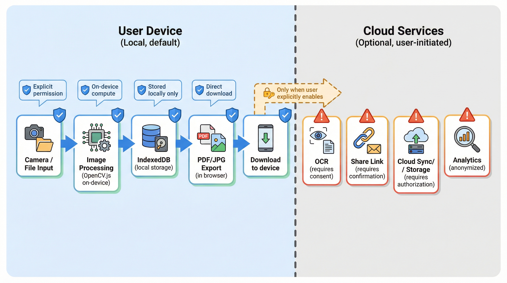

# 6. 安全与合规

## 隐私设计原则

### 核心原则

1. **本地优先**：所有处理默认在客户端完成，不上传服务器
2. **最小权限**：仅请求必要的设备权限
3. **透明告知**：任何数据传输前必须获得用户明确同意
4. **数据可控**：用户可随时删除本地存储的所有数据

### 数据流向



## 权限申请策略

### 相机权限

```typescript
// hooks/useCamera.ts
export function useCamera() {
  const [permission, setPermission] = useState<PermissionState>("prompt");
  const [error, setError] = useState<string | null>(null);

  const requestCamera = async () => {
    try {
      // 检查权限状态
      const result = await navigator.permissions.query({
        name: "camera" as PermissionName,
      });
      setPermission(result.state);

      if (result.state === "denied") {
        setError("相机权限已被拒绝，请在浏览器设置中开启");
        return null;
      }

      // 请求相机流
      const stream = await navigator.mediaDevices.getUserMedia({
        video: {
          facingMode: "environment", // 优先使用后置摄像头
          width: { ideal: 1920 },
          height: { ideal: 1080 },
        },
      });

      setPermission("granted");
      return stream;
    } catch (err) {
      if (err instanceof DOMException) {
        switch (err.name) {
          case "NotAllowedError":
            setError("用户拒绝了相机权限");
            break;
          case "NotFoundError":
            setError("未找到相机设备");
            break;
          case "NotReadableError":
            setError("相机被其他应用占用");
            break;
          default:
            setError("相机访问失败");
        }
      }
      return null;
    }
  };

  return { permission, error, requestCamera };
}
```

### 权限申请时机

| 权限 | 申请时机           | 用户提示                         |
| ---- | ------------------ | -------------------------------- |
| 相机 | 点击"拍照"按钮时   | "应用需要访问相机以拍摄文档"     |
| 存储 | 首次保存文档时     | "将文档保存到本地浏览器存储"     |
| 下载 | 点击"导出"按钮时   | 浏览器原生下载对话框             |
| 网络 | 使用OCR/分享功能时 | "此功能需要将图片上传到云端处理" |

## 数据安全

### 本地存储安全

```typescript
// lib/storage-security.ts

// 存储配额检查
export async function checkStorageQuota(): Promise<{
  usage: number;
  quota: number;
  percent: number;
}> {
  if ("storage" in navigator && "estimate" in navigator.storage) {
    const estimate = await navigator.storage.estimate();
    return {
      usage: estimate.usage || 0,
      quota: estimate.quota || 0,
      percent: ((estimate.usage || 0) / (estimate.quota || 1)) * 100,
    };
  }
  return { usage: 0, quota: 0, percent: 0 };
}

// 安全清除数据
export async function secureDeleteDocument(documentId: string): Promise<void> {
  const db = await getDB();

  // 获取文档关联的所有页面
  const pages = await db.pages.where("documentId").equals(documentId).toArray();

  // 删除页面数据（包括Blob）
  for (const page of pages) {
    await db.pages.delete(page.id);
  }

  // 删除文档元数据
  await db.documents.delete(documentId);

  // 触发垃圾回收提示
  if ("gc" in window) {
    // @ts-ignore
    window.gc();
  }
}

// 清除所有数据
export async function clearAllData(): Promise<void> {
  const db = await getDB();
  await db.delete();
  await db.open();

  // 清除其他可能的缓存
  if ("caches" in window) {
    const cacheNames = await caches.keys();
    await Promise.all(cacheNames.map((name) => caches.delete(name)));
  }
}
```

### 传输安全

```typescript
// lib/api-client.ts

const API_BASE = process.env.NEXT_PUBLIC_API_URL;

// 安全的API调用封装
export async function secureApiCall<T>(
  endpoint: string,
  options: {
    method?: "GET" | "POST" | "PUT" | "DELETE";
    body?: FormData | Record<string, unknown>;
    headers?: Record<string, string>;
  } = {},
): Promise<T> {
  const { method = "GET", body, headers = {} } = options;

  // 确保HTTPS
  if (
    API_BASE &&
    !API_BASE.startsWith("https://") &&
    process.env.NODE_ENV === "production"
  ) {
    throw new Error("API必须使用HTTPS");
  }

  const requestHeaders: Record<string, string> = {
    ...headers,
  };

  // 如果不是FormData，设置JSON内容类型
  if (body && !(body instanceof FormData)) {
    requestHeaders["Content-Type"] = "application/json";
  }

  const response = await fetch(`${API_BASE}${endpoint}`, {
    method,
    headers: requestHeaders,
    body: body instanceof FormData ? body : JSON.stringify(body),
    credentials: "same-origin", // 不发送跨域cookie
  });

  if (!response.ok) {
    throw new Error(`API错误: ${response.status}`);
  }

  return response.json();
}
```

## 上传前确认机制

### OCR上传确认

```typescript
// components/OCRConfirmDialog.tsx
interface OCRConfirmDialogProps {
  open: boolean;
  onConfirm: () => void;
  onCancel: () => void;
  imagePreview: string;
}

export function OCRConfirmDialog({
  open,
  onConfirm,
  onCancel,
  imagePreview,
}: OCRConfirmDialogProps) {
  return (
    <Dialog open={open} onOpenChange={(open) => !open && onCancel()}>
      <DialogContent>
        <DialogHeader>
          <DialogTitle>确认上传图片进行OCR识别</DialogTitle>
          <DialogDescription>
            OCR文字识别需要将图片上传到云端服务器处理。
            <br />
            图片将在识别完成后立即删除，不会被保存。
          </DialogDescription>
        </DialogHeader>

        <div className="my-4">
          
        </div>

        <div className="bg-amber-50 border border-amber-200 rounded p-3 text-sm">
          <p className="font-medium text-amber-800">隐私提示：</p>
          <ul className="text-amber-700 mt-1 space-y-1">
            <li>• 图片将通过加密连接上传</li>
            <li>• 仅用于文字识别，不做其他用途</li>
            <li>• 处理完成后立即删除</li>
          </ul>
        </div>

        <DialogFooter className="mt-4">
          <Button variant="outline" onClick={onCancel}>
            取消
          </Button>
          <Button onClick={onConfirm}>确认上传并识别</Button>
        </DialogFooter>
      </DialogContent>
    </Dialog>
  );
}
```

### 分享上传确认

```typescript
// components/ShareConfirmDialog.tsx
interface ShareConfirmDialogProps {
  open: boolean;
  onConfirm: (options: ShareOptions) => void;
  onCancel: () => void;
  pageCount: number;
}

interface ShareOptions {
  expireIn: number;
  password?: string;
  allowDownload: boolean;
}

export function ShareConfirmDialog({
  open,
  onConfirm,
  onCancel,
  pageCount,
}: ShareConfirmDialogProps) {
  const [expireIn, setExpireIn] = useState(86400); // 默认24小时
  const [password, setPassword] = useState("");
  const [allowDownload, setAllowDownload] = useState(true);

  return (
    <Dialog open={open} onOpenChange={(open) => !open && onCancel()}>
      <DialogContent>
        <DialogHeader>
          <DialogTitle>创建分享链接</DialogTitle>
          <DialogDescription>
            将文档上传到云端并生成分享链接。共 {pageCount} 页文档。
          </DialogDescription>
        </DialogHeader>

        <div className="space-y-4 my-4">
          {/* 有效期选择 */}
          <div>
            <label className="text-sm font-medium">链接有效期</label>
            <select
              value={expireIn}
              onChange={(e) => setExpireIn(Number(e.target.value))}
              className="w-full mt-1 border rounded p-2"
            >
              <option value={3600}>1小时</option>
              <option value={86400}>24小时</option>
              <option value={604800}>7天</option>
              <option value={2592000}>30天</option>
            </select>
          </div>

          {/* 密码保护 */}
          <div>
            <label className="text-sm font-medium">访问密码（可选）</label>
            <input
              type="text"
              value={password}
              onChange={(e) => setPassword(e.target.value)}
              placeholder="留空则不设置密码"
              className="w-full mt-1 border rounded p-2"
            />
          </div>

          {/* 下载权限 */}
          <div className="flex items-center gap-2">
            <input
              type="checkbox"
              id="allowDownload"
              checked={allowDownload}
              onChange={(e) => setAllowDownload(e.target.checked)}
            />
            <label htmlFor="allowDownload" className="text-sm">
              允许查看者下载原文件
            </label>
          </div>
        </div>

        <div className="bg-blue-50 border border-blue-200 rounded p-3 text-sm">
          <p className="font-medium text-blue-800">上传说明：</p>
          <ul className="text-blue-700 mt-1 space-y-1">
            <li>• 文档将上传到云端存储</li>
            <li>• 链接过期后文档将自动删除</li>
            <li>• 您可以随时手动删除分享</li>
          </ul>
        </div>

        <DialogFooter className="mt-4">
          <Button variant="outline" onClick={onCancel}>
            取消
          </Button>
          <Button
            onClick={() =>
              onConfirm({
                expireIn,
                password: password || undefined,
                allowDownload,
              })
            }
          >
            创建分享链接
          </Button>
        </DialogFooter>
      </DialogContent>
    </Dialog>
  );
}
```

## 合规清单

### GDPR / 个人信息保护合规

| 要求       | 实现方案                     | 状态      |
| ---------- | ---------------------------- | --------- |
| 数据最小化 | 仅收集必要信息，默认本地处理 | ✅ 已实现 |
| 目的限制   | 明确说明数据用途（OCR/分享） | ✅ 已实现 |
| 用户同意   | 上传前弹窗确认，可随时撤回   | ✅ 已实现 |
| 数据访问权 | 提供数据导出功能             | ⏳ 计划中 |
| 数据删除权 | 一键清除所有本地数据         | ✅ 已实现 |
| 数据可携带 | PDF/JPG导出即为数据可携带    | ✅ 已实现 |
| 安全措施   | HTTPS传输、本地加密存储      | ✅ 已实现 |
| 违规通知   | 后端需实现安全事件通知机制   | ⏳ 计划中 |

### 应用商店合规

| 平台    | 要求         | 实现方案         |
| ------- | ------------ | ---------------- |
| iOS PWA | 相机权限说明 | Info.plist描述   |
| Android | 权限声明     | manifest权限说明 |
| 通用    | 隐私政策     | /privacy页面     |
| 通用    | 服务条款     | /terms页面       |

## 审计日志

### 前端审计日志（可选）

```typescript
// lib/audit-logger.ts

type AuditAction =
  | "CAMERA_ACCESS"
  | "FILE_UPLOAD"
  | "DOCUMENT_CREATE"
  | "DOCUMENT_DELETE"
  | "OCR_REQUEST"
  | "SHARE_CREATE"
  | "DATA_EXPORT"
  | "DATA_CLEAR";

interface AuditEntry {
  timestamp: Date;
  action: AuditAction;
  details?: Record<string, unknown>;
  success: boolean;
  error?: string;
}

class AuditLogger {
  private logs: AuditEntry[] = [];
  private maxLogs = 1000;

  log(action: AuditAction, details?: Record<string, unknown>, error?: string) {
    const entry: AuditEntry = {
      timestamp: new Date(),
      action,
      details,
      success: !error,
      error,
    };

    this.logs.push(entry);

    // 限制日志数量
    if (this.logs.length > this.maxLogs) {
      this.logs = this.logs.slice(-this.maxLogs);
    }

    // 开发环境打印
    if (process.env.NODE_ENV === "development") {
      console.log("[Audit]", entry);
    }
  }

  getLogs(): AuditEntry[] {
    return [...this.logs];
  }

  exportLogs(): string {
    return JSON.stringify(this.logs, null, 2);
  }

  clearLogs() {
    this.logs = [];
  }
}

export const auditLogger = new AuditLogger();
```

## 安全检查清单

### 开发阶段

- [ ] 所有API使用HTTPS
- [ ] 敏感操作有用户确认
- [ ] 无硬编码密钥/密码
- [ ] 依赖库无已知漏洞
- [ ] 输入验证完整
- [ ] 错误信息不泄露敏感信息

### 发布前

- [ ] CSP头配置正确
- [ ] 跨域配置安全
- [ ] Cookie设置HttpOnly/Secure
- [ ] 隐私政策页面完整
- [ ] 服务条款页面完整
- [ ] 权限申请说明清晰

### 运维阶段

- [ ] 定期依赖更新
- [ ] 监控异常访问
- [ ] 日志脱敏处理
- [ ] 数据备份策略
- [ ] 应急响应流程
