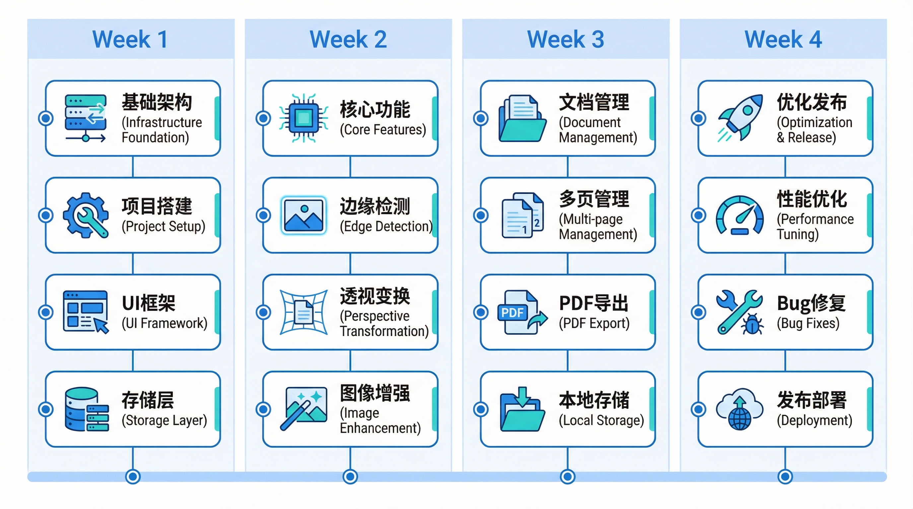

# 7. 里程碑计划

## 总体时间线

## 详细里程碑

### Week 1：项目基础架构

#### 目标

- 完成项目脚手架搭建
- 实现基础UI框架
- 完成本地存储层

#### 任务清单

| 任务                      | 优先级 | 预估工时 | 产出物                 |
| ------------------------- | ------ | -------- | ---------------------- |
| Next.js 15项目初始化      | P0     | 2h       | 项目结构、配置文件     |
| Tailwind + shadcn/ui 配置 | P0     | 2h       | UI组件库可用           |
| 路由结构搭建              | P0     | 3h       | 所有页面路由           |
| Zustand 状态管理          | P0     | 2h       | Store定义、Provider    |
| Dexie.js IndexedDB 集成   | P0     | 3h       | DB Schema、CRUD方法    |
| 基础布局组件              | P1     | 4h       | Header、Footer、Layout |
| 相机权限申请流程          | P1     | 3h       | useCamera Hook         |
| 文件上传组件              | P1     | 3h       | FileUploader组件       |
| OpenCV.js 加载机制        | P1     | 2h       | 异步加载、Worker封装   |

#### 验收标准

- [ ] 项目能正常启动，无报错
- [ ] 能访问所有规划路由
- [ ] IndexedDB 读写功能正常
- [ ] 相机权限申请流程完整
- [ ] OpenCV.js 能正常加载

---

### Week 2：核心扫描功能

#### 目标

- 完成边缘检测算法
- 实现透视变换
- 完成基础图像增强

#### 任务清单

| 任务                     | 优先级 | 预估工时 | 产出物               |
| ------------------------ | ------ | -------- | -------------------- |
| 相机取景组件             | P0     | 4h       | CameraView组件       |
| 边缘检测算法实现         | P0     | 6h       | detectEdges函数      |
| 四点角点拖拽组件         | P0     | 5h       | CornerHandles组件    |
| 透视变换实现             | P0     | 4h       | perspectiveTransform |
| Canvas预览组件           | P0     | 4h       | ImageCanvas组件      |
| 滤镜切换(原色/灰度/黑白) | P1     | 4h       | FilterSelector组件   |
| CSS滤镜预览              | P1     | 2h       | getCSSFilter函数     |
| 去阴影增强               | P1     | 4h       | removeShadow函数     |
| 清晰度调节               | P2     | 3h       | SharpnessSlider组件  |
| Web Worker集成           | P1     | 3h       | opencv.worker.ts     |

#### 验收标准

- [ ] 能拍照/上传图片
- [ ] 自动检测文档边缘（成功率>70%）
- [ ] 可手动调整四个角点
- [ ] 透视变换输出矩形图像
- [ ] 三种滤镜实时预览
- [ ] 去阴影功能可用

---

### Week 3：文档管理与导出

#### 目标

- 完成多页文档管理
- 实现PDF/JPG导出
- 完成文档列表页

#### 任务清单

| 任务            | 优先级 | 预估工时 | 产出物               |
| --------------- | ------ | -------- | -------------------- |
| 多页管理页面    | P0     | 5h       | PagesPage组件        |
| 页面拖拽排序    | P0     | 4h       | SortablePageList组件 |
| 添加页面流程    | P0     | 3h       | AddPage功能          |
| 删除页面功能    | P0     | 2h       | DeletePage功能       |
| pdf-lib PDF生成 | P0     | 5h       | exportToPDF函数      |
| JPG单页导出     | P0     | 2h       | exportToJPG函数      |
| 导出预览页面    | P1     | 4h       | ExportPage组件       |
| 文档列表页      | P1     | 5h       | HomePage组件         |
| 文档搜索功能    | P1     | 3h       | SearchBar组件        |
| 文档详情页      | P2     | 4h       | DocumentDetail组件   |

#### 验收标准

- [ ] 支持多页文档管理
- [ ] 页面可拖拽排序
- [ ] 能添加/删除页面
- [ ] PDF导出功能正常（含多页）
- [ ] JPG导出功能正常
- [ ] 文档列表显示正确
- [ ] 搜索功能可用

---

### Week 4：优化与发布

#### 目标

- 性能优化达标
- 完成bug修复
- 部署上线

#### 任务清单

| 任务              | 优先级 | 预估工时 | 产出物            |
| ----------------- | ------ | -------- | ----------------- |
| 性能优化-边缘检测 | P0     | 4h       | <2s处理12MP图片   |
| 性能优化-PDF生成  | P0     | 3h       | <5s生成10页PDF    |
| 内存泄漏排查      | P0     | 4h       | 无内存泄漏        |
| 移动端适配优化    | P1     | 4h       | 响应式布局完善    |
| 离线PWA支持       | P1     | 3h       | Service Worker    |
| 错误边界处理      | P1     | 2h       | ErrorBoundary组件 |
| E2E测试用例       | P2     | 4h       | Playwright测试    |
| Vercel部署配置    | P0     | 2h       | 生产环境可访问    |
| 文档完善          | P1     | 3h       | README、使用说明  |
| 发布前checklist   | P0     | 2h       | 所有验收项通过    |

#### 验收标准

- [ ] 边缘检测 < 2s (12MP)
- [ ] PDF生成 < 5s (10页)
- [ ] 首屏加载 < 3s (4G)
- [ ] 无内存泄漏
- [ ] 移动端体验流畅
- [ ] PWA可安装
- [ ] 生产环境正常运行

---

## 风险缓冲

| 风险项              | 缓冲策略        | 备用方案         |
| ------------------- | --------------- | ---------------- |
| OpenCV.js性能不达标 | 预留2天优化时间 | 降级使用简化算法 |
| 移动端兼容性问题    | 预留3天测试修复 | 标注最低支持版本 |
| PDF导出质量问题     | 预留2天调优     | 提供质量选项     |
| 上线部署问题        | 预留1天处理     | 使用备选部署平台 |

## 每日站会检查点

### Week 1 Daily Checklist

- Day 1: 项目初始化完成，依赖安装无报错
- Day 2: UI框架配置完成，能渲染基础组件
- Day 3: 路由结构完成，状态管理可用
- Day 4: IndexedDB集成完成，CRUD测试通过
- Day 5: OpenCV.js加载成功，相机权限流程完成

### Week 2 Daily Checklist

- Day 1: 相机取景组件完成
- Day 2: 边缘检测算法初版完成
- Day 3: 四点拖拽组件完成
- Day 4: 透视变换完成，端到端流程跑通
- Day 5: 滤镜功能完成，去阴影可用

### Week 3 Daily Checklist

- Day 1: 多页管理页面完成
- Day 2: 拖拽排序完成
- Day 3: PDF导出完成
- Day 4: 文档列表页完成
- Day 5: 搜索功能完成，导出流程完整

### Week 4 Daily Checklist

- Day 1: 性能优化完成，达标
- Day 2: 移动端适配完成
- Day 3: PWA支持完成，错误处理完善
- Day 4: 测试覆盖，bug修复
- Day 5: 部署上线，文档完善

## 发布前验收清单

### 功能验收

- [ ] F1: 图片导入（相机+上传+批量）
- [ ] F2: 边缘检测（自动+手动调整）
- [ ] F3: 透视矫正（输出矩形图像）
- [ ] F4: 图像增强（3滤镜+去阴影+清晰度）
- [ ] F5: 多页文档（排序+添加+删除）
- [ ] F6: 导出（PDF多页+JPG单页）
- [ ] F7: 文档管理（列表+搜索+详情）

### 性能验收

- [ ] 边缘检测 < 2s (12MP)
- [ ] 滤镜切换 < 100ms
- [ ] PDF生成 < 5s (10页)
- [ ] 首屏加载 < 3s (4G)
- [ ] IndexedDB写入 < 500ms

### 兼容性验收

- [ ] Desktop Chrome 90+
- [ ] Desktop Safari 14+
- [ ] Desktop Firefox 88+
- [ ] Desktop Edge 90+
- [ ] iOS Safari 14+
- [ ] Android Chrome 90+

### 安全验收

- [ ] HTTPS强制
- [ ] 权限申请规范
- [ ] 上传确认机制
- [ ] 数据删除功能
- [ ] 隐私政策页面
