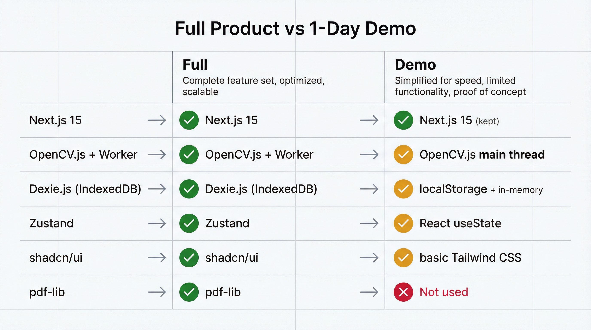
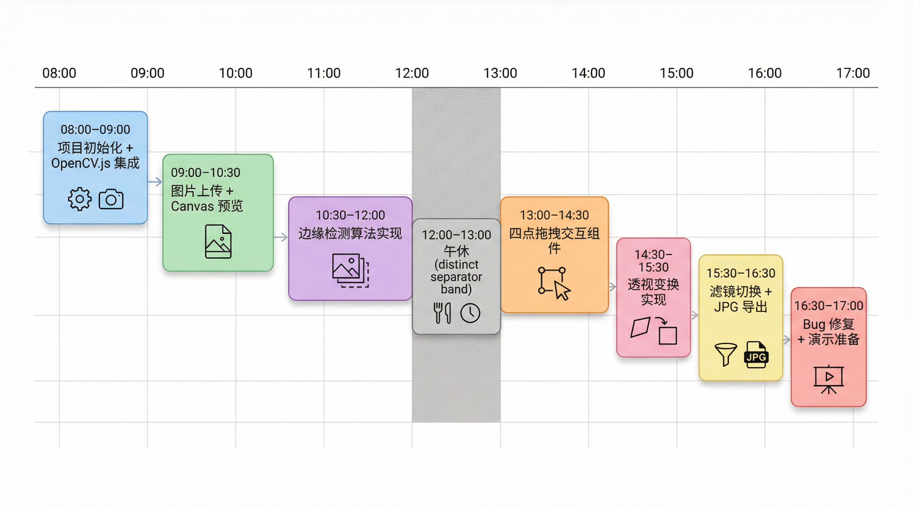

# 10. 1天可跑通的演示版方案

## 目标

在 **1 个工作日（8小时）** 内完成一个可演示的核心功能原型，验证技术可行性并获取早期反馈。

## 演示版范围

### 包含功能（Must Have）

| 功能     | 简化方案                  | 完整版差异          |
| -------- | ------------------------- | ------------------- |
| 图片导入 | 仅支持文件上传            | 完整版支持相机拍照  |
| 边缘检测 | 固定参数，无自动调优      | 完整版有自适应参数  |
| 四点调整 | 基础拖拽，无吸附/辅助线   | 完整版有智能吸附    |
| 透视矫正 | 固定输出 A4 比例          | 完整版支持多种比例  |
| 滤镜预览 | 仅原色/灰度/黑白 3 种     | 完整版有去阴影/锐化 |
| 单页导出 | 仅 JPG 导出               | 完整版支持 PDF      |
| 本地存储 | 使用 localStorage（临时） | 完整版用 IndexedDB  |

### 不包含功能（Defer）

- ❌ 相机实时取景
- ❌ 多页文档管理
- ❌ PDF 导出
- ❌ 文档列表/搜索
- ❌ PWA 离线支持
- ❌ 去阴影/锐化增强
- ❌ 移动端适配优化

## 技术栈简化



## 时间分配（8小时）



## 目录结构（最小化）

```
demo/
├── app/
│   ├── layout.tsx         # 基础布局
│   ├── page.tsx           # 首页（上传入口）
│   └── editor/
│       └── page.tsx       # 编辑器页面（核心）
├── components/
│   ├── FileUploader.tsx   # 文件上传组件
│   ├── ImageCanvas.tsx    # 图片预览 Canvas
│   ├── CornerHandles.tsx  # 四点拖拽
│   └── FilterSelector.tsx # 滤镜选择
├── lib/
│   ├── opencv-loader.ts   # OpenCV.js 加载器
│   ├── edge-detect.ts     # 边缘检测
│   ├── perspective.ts     # 透视变换
│   └── filters.ts         # 滤镜处理
├── public/
│   └── opencv.js          # OpenCV.js 文件
└── package.json
```

## 核心代码实现

### 1. OpenCV.js 简化加载器

```typescript
// lib/opencv-loader.ts
declare global {
  interface Window {
    cv: any;
    Module: any;
  }
}

let cvReady = false;
let cvPromise: Promise<any> | null = null;

export function loadOpenCV(): Promise<any> {
  if (cvReady && window.cv) {
    return Promise.resolve(window.cv);
  }

  if (cvPromise) {
    return cvPromise;
  }

  cvPromise = new Promise((resolve, reject) => {
    const script = document.createElement("script");
    script.src = "/opencv.js";
    script.async = true;

    script.onload = () => {
      // OpenCV.js 使用 Module 回调
      if (window.cv && window.cv.then) {
        window.cv.then(() => {
          cvReady = true;
          resolve(window.cv);
        });
      } else {
        // 兼容不同版本
        const checkReady = setInterval(() => {
          if (window.cv && window.cv.Mat) {
            clearInterval(checkReady);
            cvReady = true;
            resolve(window.cv);
          }
        }, 100);

        setTimeout(() => {
          clearInterval(checkReady);
          reject(new Error("OpenCV.js 加载超时"));
        }, 30000);
      }
    };

    script.onerror = () => reject(new Error("OpenCV.js 加载失败"));
    document.head.appendChild(script);
  });

  return cvPromise;
}
```

### 2. 简化边缘检测

```typescript
// lib/edge-detect.ts
export interface Point {
  x: number;
  y: number;
}

export interface DetectionResult {
  corners: [Point, Point, Point, Point]; // 左上、右上、右下、左下
  confidence: number;
}

export async function detectEdges(
  imageData: ImageData,
): Promise<DetectionResult> {
  const cv = window.cv;

  // 创建 Mat
  const src = cv.matFromImageData(imageData);
  const gray = new cv.Mat();
  const blurred = new cv.Mat();
  const edges = new cv.Mat();

  try {
    // 灰度化
    cv.cvtColor(src, gray, cv.COLOR_RGBA2GRAY);

    // 高斯模糊
    cv.GaussianBlur(gray, blurred, new cv.Size(5, 5), 0);

    // Canny 边缘检测
    cv.Canny(blurred, edges, 75, 200);

    // 查找轮廓
    const contours = new cv.MatVector();
    const hierarchy = new cv.Mat();
    cv.findContours(
      edges,
      contours,
      hierarchy,
      cv.RETR_EXTERNAL,
      cv.CHAIN_APPROX_SIMPLE,
    );

    // 找最大四边形轮廓
    let maxArea = 0;
    let bestContour: any = null;

    for (let i = 0; i < contours.size(); i++) {
      const contour = contours.get(i);
      const area = cv.contourArea(contour);

      if (area > maxArea) {
        const peri = cv.arcLength(contour, true);
        const approx = new cv.Mat();
        cv.approxPolyDP(contour, approx, 0.02 * peri, true);

        if (approx.rows === 4) {
          maxArea = area;
          bestContour = approx;
        }
        approx.delete();
      }
    }

    // 默认角点（图片边界）
    const defaultCorners: [Point, Point, Point, Point] = [
      { x: 0, y: 0 },
      { x: imageData.width, y: 0 },
      { x: imageData.width, y: imageData.height },
      { x: 0, y: imageData.height },
    ];

    if (!bestContour) {
      contours.delete();
      hierarchy.delete();
      return { corners: defaultCorners, confidence: 0 };
    }

    // 提取并排序角点
    const points: Point[] = [];
    for (let i = 0; i < 4; i++) {
      points.push({
        x: bestContour.data32S[i * 2],
        y: bestContour.data32S[i * 2 + 1],
      });
    }

    const sortedCorners = sortCorners(points);
    const confidence =
      maxArea / (imageData.width * imageData.height) > 0.1 ? 0.8 : 0.5;

    contours.delete();
    hierarchy.delete();
    bestContour.delete();

    return { corners: sortedCorners, confidence };
  } finally {
    src.delete();
    gray.delete();
    blurred.delete();
    edges.delete();
  }
}

// 角点排序：左上、右上、右下、左下
function sortCorners(points: Point[]): [Point, Point, Point, Point] {
  // 按 y 坐标分成上下两组
  const sorted = [...points].sort((a, b) => a.y - b.y);
  const top = sorted.slice(0, 2).sort((a, b) => a.x - b.x);
  const bottom = sorted.slice(2, 4).sort((a, b) => a.x - b.x);

  return [
    top[0], // 左上
    top[1], // 右上
    bottom[1], // 右下
    bottom[0], // 左下
  ];
}
```

### 3. 透视变换

```typescript
// lib/perspective.ts
import type { Point } from "./edge-detect";

export interface TransformOptions {
  outputWidth?: number;
  outputHeight?: number;
}

export function perspectiveTransform(
  imageData: ImageData,
  corners: [Point, Point, Point, Point],
  options: TransformOptions = {},
): ImageData {
  const cv = window.cv;

  // 计算输出尺寸（默认 A4 比例）
  const { outputWidth = 595, outputHeight = 842 } = options;

  const src = cv.matFromImageData(imageData);
  const dst = new cv.Mat();

  try {
    // 源点（检测到的四个角）
    const srcPoints = cv.matFromArray(4, 1, cv.CV_32FC2, [
      corners[0].x,
      corners[0].y,
      corners[1].x,
      corners[1].y,
      corners[2].x,
      corners[2].y,
      corners[3].x,
      corners[3].y,
    ]);

    // 目标点（矩形输出）
    const dstPoints = cv.matFromArray(4, 1, cv.CV_32FC2, [
      0,
      0,
      outputWidth,
      0,
      outputWidth,
      outputHeight,
      0,
      outputHeight,
    ]);

    // 计算变换矩阵
    const M = cv.getPerspectiveTransform(srcPoints, dstPoints);

    // 应用变换
    cv.warpPerspective(
      src,
      dst,
      M,
      new cv.Size(outputWidth, outputHeight),
      cv.INTER_LINEAR,
      cv.BORDER_CONSTANT,
      new cv.Scalar(255, 255, 255, 255),
    );

    // 转换回 ImageData
    const result = new ImageData(
      new Uint8ClampedArray(dst.data),
      outputWidth,
      outputHeight,
    );

    srcPoints.delete();
    dstPoints.delete();
    M.delete();

    return result;
  } finally {
    src.delete();
    dst.delete();
  }
}
```

### 4. 滤镜处理

```typescript
// lib/filters.ts
export type FilterType = "original" | "grayscale" | "blackwhite";

export function applyFilter(
  imageData: ImageData,
  filter: FilterType,
): ImageData {
  const cv = window.cv;
  const src = cv.matFromImageData(imageData);
  const dst = new cv.Mat();

  try {
    switch (filter) {
      case "grayscale": {
        cv.cvtColor(src, dst, cv.COLOR_RGBA2GRAY);
        cv.cvtColor(dst, dst, cv.COLOR_GRAY2RGBA);
        break;
      }

      case "blackwhite": {
        const gray = new cv.Mat();
        cv.cvtColor(src, gray, cv.COLOR_RGBA2GRAY);
        cv.adaptiveThreshold(
          gray,
          dst,
          255,
          cv.ADAPTIVE_THRESH_GAUSSIAN_C,
          cv.THRESH_BINARY,
          11,
          2,
        );
        cv.cvtColor(dst, dst, cv.COLOR_GRAY2RGBA);
        gray.delete();
        break;
      }

      default:
        src.copyTo(dst);
    }

    return new ImageData(
      new Uint8ClampedArray(dst.data),
      imageData.width,
      imageData.height,
    );
  } finally {
    src.delete();
    dst.delete();
  }
}

// CSS 滤镜预览（不使用 OpenCV，用于实时预览）
export function getCSSFilter(filter: FilterType): string {
  switch (filter) {
    case "grayscale":
      return "grayscale(100%)";
    case "blackwhite":
      return "grayscale(100%) contrast(200%)";
    default:
      return "none";
  }
}
```

### 5. 编辑器页面（核心）

```tsx
// app/editor/page.tsx
"use client";

import { useState, useEffect, useRef, useCallback } from "react";
import { loadOpenCV } from "@/lib/opencv-loader";
import { detectEdges, Point, DetectionResult } from "@/lib/edge-detect";
import { perspectiveTransform } from "@/lib/perspective";
import { applyFilter, FilterType, getCSSFilter } from "@/lib/filters";

type EditorStep = "crop" | "filter" | "export";

export default function EditorPage() {
  const [step, setStep] = useState<EditorStep>("crop");
  const [cvReady, setCvReady] = useState(false);
  const [loading, setLoading] = useState(false);
  const [error, setError] = useState<string | null>(null);

  // 图像状态
  const [originalImage, setOriginalImage] = useState<HTMLImageElement | null>(
    null,
  );
  const [originalImageData, setOriginalImageData] = useState<ImageData | null>(
    null,
  );
  const [corners, setCorners] = useState<[Point, Point, Point, Point] | null>(
    null,
  );
  const [croppedImageData, setCroppedImageData] = useState<ImageData | null>(
    null,
  );
  const [filter, setFilter] = useState<FilterType>("original");
  const [finalImageData, setFinalImageData] = useState<ImageData | null>(null);

  const canvasRef = useRef<HTMLCanvasElement>(null);
  const previewCanvasRef = useRef<HTMLCanvasElement>(null);

  // 加载 OpenCV
  useEffect(() => {
    loadOpenCV()
      .then(() => setCvReady(true))
      .catch((err) => setError(err.message));
  }, []);

  // 从 localStorage 读取图片
  useEffect(() => {
    const imageDataUrl = localStorage.getItem("pendingImage");
    if (!imageDataUrl) {
      setError("未找到待处理图片");
      return;
    }

    const img = new Image();
    img.onload = () => {
      setOriginalImage(img);

      // 转换为 ImageData
      const canvas = document.createElement("canvas");
      canvas.width = img.width;
      canvas.height = img.height;
      const ctx = canvas.getContext("2d")!;
      ctx.drawImage(img, 0, 0);
      const imageData = ctx.getImageData(0, 0, img.width, img.height);
      setOriginalImageData(imageData);
    };
    img.src = imageDataUrl;
  }, []);

  // 自动边缘检测
  useEffect(() => {
    if (!cvReady || !originalImageData) return;

    setLoading(true);
    detectEdges(originalImageData)
      .then((result) => {
        setCorners(result.corners);
        setLoading(false);
      })
      .catch((err) => {
        setError(err.message);
        setLoading(false);
      });
  }, [cvReady, originalImageData]);

  // 绘制裁剪画布
  useEffect(() => {
    if (!originalImage || !corners || !canvasRef.current) return;

    const canvas = canvasRef.current;
    const ctx = canvas.getContext("2d")!;

    // 设置画布尺寸
    const scale = Math.min(
      600 / originalImage.width,
      400 / originalImage.height,
    );
    canvas.width = originalImage.width * scale;
    canvas.height = originalImage.height * scale;

    // 绘制图片
    ctx.drawImage(originalImage, 0, 0, canvas.width, canvas.height);

    // 绘制四边形
    ctx.strokeStyle = "#3b82f6";
    ctx.lineWidth = 2;
    ctx.beginPath();
    corners.forEach((corner, i) => {
      const x = corner.x * scale;
      const y = corner.y * scale;
      if (i === 0) ctx.moveTo(x, y);
      else ctx.lineTo(x, y);
    });
    ctx.closePath();
    ctx.stroke();

    // 绘制角点
    corners.forEach((corner) => {
      const x = corner.x * scale;
      const y = corner.y * scale;
      ctx.fillStyle = "#3b82f6";
      ctx.beginPath();
      ctx.arc(x, y, 8, 0, Math.PI * 2);
      ctx.fill();
      ctx.fillStyle = "#fff";
      ctx.beginPath();
      ctx.arc(x, y, 4, 0, Math.PI * 2);
      ctx.fill();
    });
  }, [originalImage, corners]);

  // 执行透视变换
  const handleCrop = useCallback(() => {
    if (!originalImageData || !corners) return;

    setLoading(true);
    try {
      const cropped = perspectiveTransform(originalImageData, corners);
      setCroppedImageData(cropped);
      setStep("filter");
    } catch (err: any) {
      setError(err.message);
    }
    setLoading(false);
  }, [originalImageData, corners]);

  // 应用滤镜并导出
  const handleExport = useCallback(() => {
    if (!croppedImageData) return;

    setLoading(true);
    try {
      const filtered = applyFilter(croppedImageData, filter);
      setFinalImageData(filtered);
      setStep("export");
    } catch (err: any) {
      setError(err.message);
    }
    setLoading(false);
  }, [croppedImageData, filter]);

  // 下载 JPG
  const handleDownload = useCallback(() => {
    if (!finalImageData) return;

    const canvas = document.createElement("canvas");
    canvas.width = finalImageData.width;
    canvas.height = finalImageData.height;
    const ctx = canvas.getContext("2d")!;
    ctx.putImageData(finalImageData, 0, 0);

    const link = document.createElement("a");
    link.download = `scan_${Date.now()}.jpg`;
    link.href = canvas.toDataURL("image/jpeg", 0.9);
    link.click();
  }, [finalImageData]);

  // 显示预览
  useEffect(() => {
    if (!previewCanvasRef.current) return;

    const canvas = previewCanvasRef.current;
    const ctx = canvas.getContext("2d")!;

    let imageData: ImageData | null = null;
    if (step === "filter" && croppedImageData) {
      imageData = croppedImageData;
    } else if (step === "export" && finalImageData) {
      imageData = finalImageData;
    }

    if (imageData) {
      canvas.width = imageData.width;
      canvas.height = imageData.height;
      ctx.putImageData(imageData, 0, 0);
    }
  }, [step, croppedImageData, finalImageData]);

  if (error) {
    return (
      <div className="min-h-screen flex items-center justify-center">
        <div className="text-red-500 text-center">
          <p className="text-xl mb-4">出错了</p>
          <p>{error}</p>
          <button
            onClick={() => (window.location.href = "/")}
            className="mt-4 px-4 py-2 bg-blue-500 text-white rounded"
          >
            返回首页
          </button>
        </div>
      </div>
    );
  }

  return (
    <div className="min-h-screen bg-gray-100 p-4">
      {/* 步骤指示器 */}
      <div className="flex justify-center mb-6">
        {["crop", "filter", "export"].map((s, i) => (
          <div key={s} className="flex items-center">
            <div
              className={`w-8 h-8 rounded-full flex items-center justify-center ${
                step === s
                  ? "bg-blue-500 text-white"
                  : i < ["crop", "filter", "export"].indexOf(step)
                    ? "bg-green-500 text-white"
                    : "bg-gray-300"
              }`}
            >
              {i + 1}
            </div>
            {i < 2 && <div className="w-16 h-1 bg-gray-300 mx-2" />}
          </div>
        ))}
      </div>

      {/* 加载状态 */}
      {(loading || !cvReady) && (
        <div className="fixed inset-0 bg-black/50 flex items-center justify-center z-50">
          <div className="bg-white rounded-lg p-6 text-center">
            <div className="animate-spin w-8 h-8 border-4 border-blue-500 border-t-transparent rounded-full mx-auto mb-4" />
            <p>{!cvReady ? "加载图像处理引擎..." : "处理中..."}</p>
          </div>
        </div>
      )}

      {/* 步骤 1: 裁剪 */}
      {step === "crop" && corners && (
        <div className="max-w-2xl mx-auto">
          <h2 className="text-xl font-bold text-center mb-4">调整文档边界</h2>
          <p className="text-gray-500 text-center mb-4">
            拖动角点调整文档边界（演示版暂不支持拖拽）
          </p>
          <div className="bg-white rounded-lg p-4 shadow">
            <canvas ref={canvasRef} className="mx-auto" />
          </div>
          <div className="mt-4 flex justify-center">
            <button
              onClick={handleCrop}
              className="px-6 py-2 bg-blue-500 text-white rounded-lg hover:bg-blue-600"
            >
              确认裁剪
            </button>
          </div>
        </div>
      )}

      {/* 步骤 2: 滤镜 */}
      {step === "filter" && croppedImageData && (
        <div className="max-w-2xl mx-auto">
          <h2 className="text-xl font-bold text-center mb-4">选择滤镜效果</h2>
          <div className="bg-white rounded-lg p-4 shadow">
            <canvas
              ref={previewCanvasRef}
              className="mx-auto max-h-96 object-contain"
              style={{ filter: getCSSFilter(filter) }}
            />
          </div>
          <div className="mt-4 flex justify-center gap-4">
            {(["original", "grayscale", "blackwhite"] as FilterType[]).map(
              (f) => (
                <button
                  key={f}
                  onClick={() => setFilter(f)}
                  className={`px-4 py-2 rounded-lg ${
                    filter === f
                      ? "bg-blue-500 text-white"
                      : "bg-gray-200 hover:bg-gray-300"
                  }`}
                >
                  {f === "original"
                    ? "原色"
                    : f === "grayscale"
                      ? "灰度"
                      : "黑白"}
                </button>
              ),
            )}
          </div>
          <div className="mt-4 flex justify-center gap-4">
            <button
              onClick={() => setStep("crop")}
              className="px-6 py-2 bg-gray-200 rounded-lg hover:bg-gray-300"
            >
              上一步
            </button>
            <button
              onClick={handleExport}
              className="px-6 py-2 bg-blue-500 text-white rounded-lg hover:bg-blue-600"
            >
              应用滤镜
            </button>
          </div>
        </div>
      )}

      {/* 步骤 3: 导出 */}
      {step === "export" && finalImageData && (
        <div className="max-w-2xl mx-auto">
          <h2 className="text-xl font-bold text-center mb-4">导出文档</h2>
          <div className="bg-white rounded-lg p-4 shadow">
            <canvas
              ref={previewCanvasRef}
              className="mx-auto max-h-96 object-contain"
            />
          </div>
          <div className="mt-4 flex justify-center gap-4">
            <button
              onClick={() => setStep("filter")}
              className="px-6 py-2 bg-gray-200 rounded-lg hover:bg-gray-300"
            >
              上一步
            </button>
            <button
              onClick={handleDownload}
              className="px-6 py-2 bg-green-500 text-white rounded-lg hover:bg-green-600"
            >
              下载 JPG
            </button>
          </div>
        </div>
      )}
    </div>
  );
}
```

### 6. 首页（上传入口）

```tsx
// app/page.tsx
"use client";

import { useCallback } from "react";
import { useRouter } from "next/navigation";

export default function HomePage() {
  const router = useRouter();

  const handleFileChange = useCallback(
    (e: React.ChangeEvent<HTMLInputElement>) => {
      const file = e.target.files?.[0];
      if (!file) return;

      const reader = new FileReader();
      reader.onload = () => {
        // 存储到 localStorage（演示版简化方案）
        localStorage.setItem("pendingImage", reader.result as string);
        router.push("/editor");
      };
      reader.readAsDataURL(file);
    },
    [router],
  );

  return (
    <div className="min-h-screen bg-gradient-to-b from-blue-50 to-white flex flex-col items-center justify-center p-4">
      <h1 className="text-3xl font-bold text-gray-800 mb-2">扫描全能王</h1>
      <p className="text-gray-500 mb-8">Demo 演示版</p>

      <label className="cursor-pointer">
        <div className="w-64 h-64 border-2 border-dashed border-blue-300 rounded-lg flex flex-col items-center justify-center hover:border-blue-500 hover:bg-blue-50 transition-colors">
          <svg
            className="w-16 h-16 text-blue-400 mb-4"
            fill="none"
            stroke="currentColor"
            viewBox="0 0 24 24"
          >
            <path
              strokeLinecap="round"
              strokeLinejoin="round"
              strokeWidth={2}
              d="M4 16l4.586-4.586a2 2 0 012.828 0L16 16m-2-2l1.586-1.586a2 2 0 012.828 0L20 14m-6-6h.01M6 20h12a2 2 0 002-2V6a2 2 0 00-2-2H6a2 2 0 00-2 2v12a2 2 0 002 2z"
            />
          </svg>
          <p className="text-gray-500">点击上传图片</p>
          <p className="text-gray-400 text-sm mt-1">支持 JPG、PNG</p>
        </div>
        <input
          type="file"
          accept="image/jpeg,image/png"
          onChange={handleFileChange}
          className="hidden"
        />
      </label>

      <div className="mt-8 text-center text-gray-400 text-sm">
        <p>演示版功能：上传图片 → 边缘检测 → 透视矫正 → 滤镜 → 导出 JPG</p>
        <p className="mt-1">完整版将支持：相机拍照、多页文档、PDF导出等</p>
      </div>
    </div>
  );
}
```

## 快速启动指南

### 1. 创建项目

```bash
npx create-next-app@latest scanner-demo --typescript --tailwind --app
cd scanner-demo
```

### 2. 下载 OpenCV.js

```bash
# 下载预编译的 OpenCV.js
curl -o public/opencv.js https://docs.opencv.org/4.8.0/opencv.js
```

### 3. 复制代码文件

按照上述目录结构创建文件，复制对应代码。

### 4. 启动开发服务器

```bash
npm run dev
```

### 5. 访问演示

打开浏览器访问 `http://localhost:3000`

## 验收标准

| 功能点   | 验收标准                        | 检查方法         |
| -------- | ------------------------------- | ---------------- |
| 图片上传 | 支持 JPG/PNG，预览正常          | 上传测试图片     |
| 边缘检测 | 能识别文档边界，显示四个角点    | 使用文档照片测试 |
| 透视矫正 | 输出矩形图像，无明显变形        | 目视检查输出     |
| 滤镜切换 | 3 种滤镜效果明显区分            | 切换滤镜查看预览 |
| JPG 导出 | 能下载 JPG 文件，图像质量可接受 | 下载并打开检查   |
| 完整流程 | 从上传到导出全流程无报错        | 完整走一遍流程   |

## 演示版到完整版的升级路径

| 演示版实现            | 完整版改进                  |
| --------------------- | --------------------------- |
| localStorage 临时存储 | → Dexie.js IndexedDB 持久化 |
| 主线程 OpenCV         | → Web Worker 后台处理       |
| React useState        | → Zustand 全局状态          |
| 固定边缘检测参数      | → 自适应参数 + 设备检测     |
| 无拖拽交互            | → 完整四点拖拽 + 智能吸附   |
| 仅 JPG 导出           | → PDF 多页导出              |
| 无文档管理            | → 完整文档列表、搜索、详情  |
| 基础 Tailwind 样式    | → shadcn/ui 组件库          |
| 仅桌面端              | → 响应式 + 移动端相机支持   |

## 已知限制

1. **无拖拽交互**：演示版角点不支持拖拽，需在完整版实现
2. **无相机支持**：仅支持文件上传，无实时取景
3. **localStorage 限制**：大图片可能超出 5MB 限制
4. **主线程阻塞**：OpenCV 操作在主线程，处理大图时 UI 可能卡顿
5. **无错误恢复**：处理失败后需要刷新页面重试

## 风险备案

| 风险                 | 发生时应对                           |
| -------------------- | ------------------------------------ |
| OpenCV.js 加载失败   | 检查网络/文件路径，准备 CDN 备用地址 |
| 边缘检测效果差       | 降低预期，文档标注"演示效果"         |
| 透视变换输出异常     | 使用简单裁剪替代                     |
| 浏览器兼容性问题     | 限定 Chrome 最新版演示               |
| 时间不够完成全部功能 | 优先保证上传→导出核心流程            |
